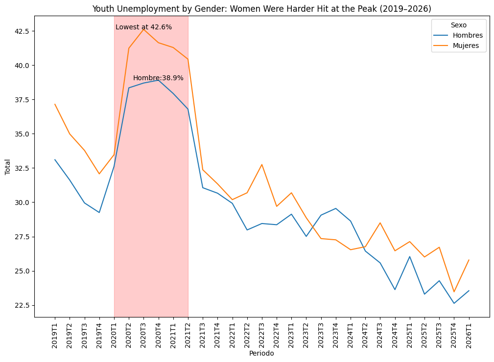

# 🇪🇸 Lost Generation? Youth Unemployment in Spain Before and After COVID-19

When COVID-19 hit Spain in early 2020, the labor market collapsed almost overnight.
But not everyone was affected equally, young workers under 25 bore the heaviest burden.
This project uses official INE survey data to explore what really happened, who suffered most, and whether Spain's youth have truly recovered by 2024.

---

## What I wanted to understand

- How bad did it actually get for young people during the pandemic?
- Were young workers hit harder than older ones, and by how much?
- Did it matter whether you were a man or a woman?
- Which regions collapsed the most, and which ones bounced back fastest?

---

## What I found

- Youth unemployment peaked at **40.5%** in Q3 2020 — more than double the rate for adults aged 25–54
- Young women reached **42.6%** at the peak, compared to **38.9%** for young men, a gap that gradually closed by 2024
- The **Canary Islands** were hit hardest at **61.7%**, largely because their economy depends almost entirely on tourism, which stopped completely during lockdowns
- **Asturias** was the only region that hadn't fully recovered by 2024, its youth unemployment was still higher than before the pandemic
- By 2024, national youth unemployment fell below pre-COVID levels, which is a real sign of recovery, though the gap with older workers hasn't gone away

---

## Visualization

> 🗺️ The choropleth map is interactive —
> [click here to explore it](https://abdelhakmorhlia01-hub.github.io/spain-epa-youth-unemployment-analysis/map.html)

*For the full analysis with all charts, open the notebook.*

---
## Data

All data comes from Spain's **Encuesta de Población Activa (EPA)**, the official quarterly labor force survey published by the Instituto Nacional de Estadística (INE).

👉 https://www.ine.es/dyngs/INEbase/es/operacion.htm?c=Estadistica_C&cid=1254736176918&menu=ultiDatos&idp=1254735976595

---

## Tools used

Python · Pandas · Seaborn · Matplotlib · GeoPandas · Folium

---

## A few things to keep in mind

- Ceuta and Melilla are not included — INE flags their data as unreliable due to very small sample sizes
- The Q1 2020 figures are slightly less reliable than usual because data collection was disrupted during the state of alarm
- Spain's ERTE furlough scheme kept many workers off the unemployment rolls during 2020–2021, so real joblessness was likely higher than the official numbers show

---

## About me

I'm Abdelhak, a data analyst based in Cartagena, Spain. I built this project to practice real-world analysis on data that actually matters, and because the story behind these numbers is worth telling.

